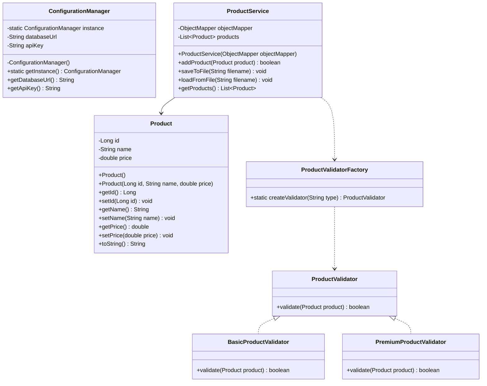
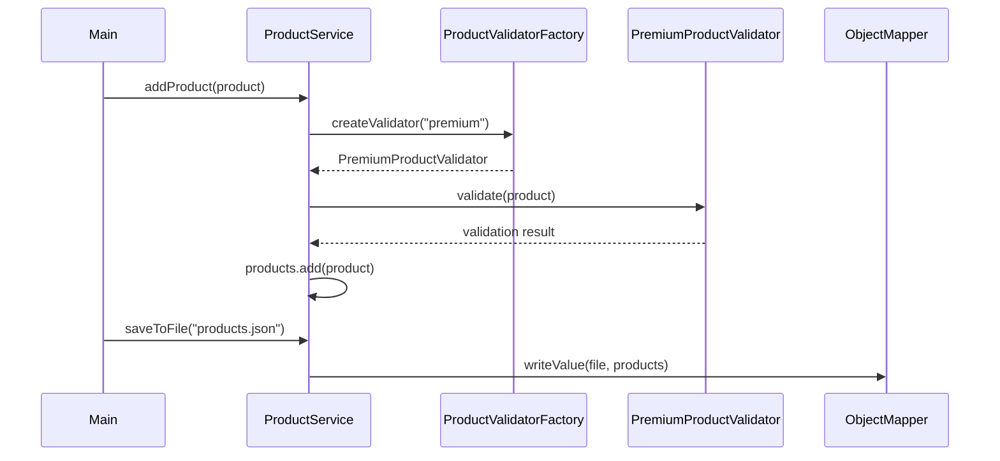
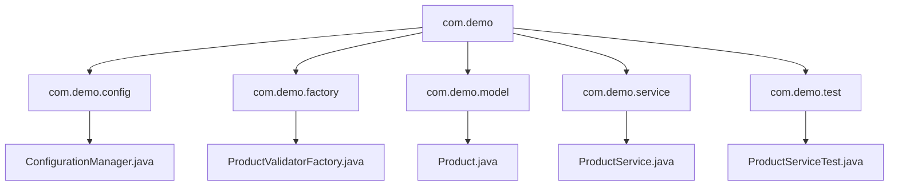
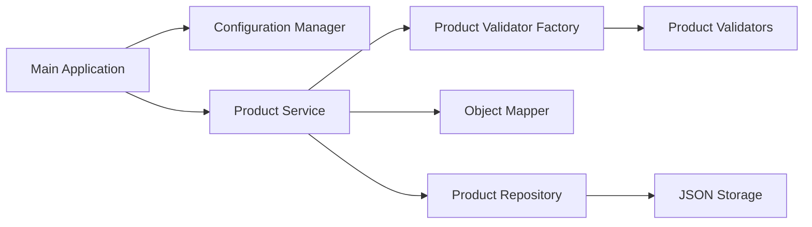

# System Design Diagrams

## Class Diagram

```mermaid
classDiagram
  class Product {
      -Long id
      -String name
      -double price
      +Product()
      +Product(Long id, String name, double price)
      +getId() Long
      +setId(Long id) void
      +getName() String
      +setName(String name) void
      +getPrice() double
      +setPrice(double price) void
      +toString() String
  }

  class ConfigurationManager {
      -static ConfigurationManager instance
      -String databaseUrl
      -String apiKey
      -ConfigurationManager()
      +static getInstance() ConfigurationManager
      +getDatabaseUrl() String
      +getApiKey() String
  }

  class ProductService {
      -ObjectMapper objectMapper
      -List~Product~ products
      +ProductService(ObjectMapper objectMapper)
      +addProduct(Product product) boolean
      +saveToFile(String filename) void
      +loadFromFile(String filename) void
      +getProducts() List~Product~
  }

  class ProductValidatorFactory {
      +static createValidator(String type) ProductValidator
  }

  class ProductValidator {
      +validate(Product product) boolean
  }

  class BasicProductValidator {
      +validate(Product product) boolean
  }

  class PremiumProductValidator {
      +validate(Product product) boolean
  }

  ProductValidator <|.. BasicProductValidator
  ProductValidator <|.. PremiumProductValidator
  ProductValidatorFactory ..> ProductValidator
  ProductService --> Product
  ProductService ..> ProductValidatorFactory
```

## Sequence Diagrams

```mermaid
sequenceDiagram
  participant Main
  participant ProductService
  participant ProductValidatorFactory
  participant PremiumProductValidator
  participant ObjectMapper

  Main->>ProductService: addProduct(product)
  ProductService->>ProductValidatorFactory: createValidator("premium")
  ProductValidatorFactory-->>ProductService: PremiumProductValidator
  ProductService->>PremiumProductValidator: validate(product)
  PremiumProductValidator-->>ProductService: validation result
  ProductService->>ProductService: products.add(product)
  Main->>ProductService: saveToFile("products.json")
  ProductService->>ObjectMapper: writeValue(file, products)
```

## Package Diagram

```mermaid
graph TD
  A[com.demo] --> B[com.demo.config]
  A --> C[com.demo.factory]
  A --> D[com.demo.model]
  A --> E[com.demo.service]
  A --> F[com.demo.test]

  B --> B1[ConfigurationManager.java]
  C --> C1[ProductValidatorFactory.java]
  D --> D1[Product.java]
  E --> E1[ProductService.java]
  F --> F1[ProductServiceTest.java]
```

## Component Diagram

```mermaid
graph LR
  A[Main Application] --> B[Configuration Manager]
  A --> C[Product Service]
  C --> D[Product Validator Factory]
  C --> E[Object Mapper]
  D --> F[Product Validators]
  C --> G[Product Repository]
  G --> H[JSON Storage]
```
